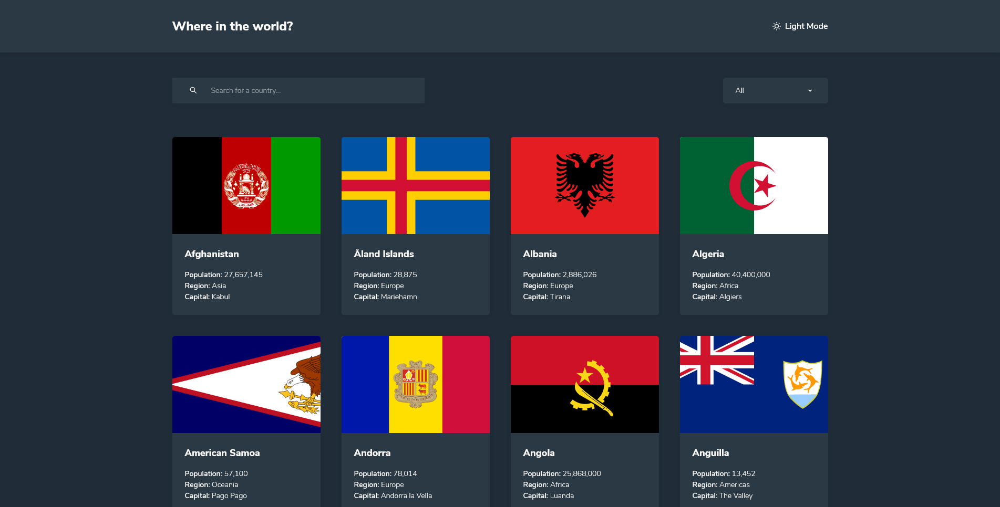

# Frontend Mentor - REST Countries API with color theme switcher

This is a solution to the [REST Countries API with color theme switcher coding challenge on Frontend Mentor](https://www.frontendmentor.io/challenges/rest-countries-api-with-color-theme-switcher-5cacc469fec04111f7b848ca). Frontend Mentor challenges help you improve your coding skills by building realistic projects.

## Table of contents

- [Overview](#overview)
  - [The challenge](#the-challenge)
  - [Screenshot](#screenshot)
  - [Links](#links)
  - [Setup](#setup)
- [My process](#my-process)
  - [Built with](#built-with)
  - [What I learned](#what-i-learned)
  - [Continued development](#continued-development)
  - [Useful resources](#useful-resources)
- [Author](#author)
- [Acknowledgments](#acknowledgments)

## Overview

### The challenge

Your users should be able to:

- See all countries from the API on the homepage
- Search for a country using an `input` field
- Filter countries by region
- Click on a country to see more detailed information on a separate page
- Click through to the border countries on the detail page
- Toggle the color scheme between light and dark mode _(optional)_

I added pagination as an extra feature

### Screenshot



### Links

[Live Site URL](https://rest-countries-api-mbart13.vercel.app)

### Setup

To run this project locally:

```
npm install && npm start
```

To run tests:

```
npm test
```

## My process

### Built with

- TypeScript
- React
- Styled Components
- React Router Dom
- Downshift
- Axios
- react-paginate
- react-media-hook
- Mobile-first workflow

### What I learned

Making accessible UI components like custom select is difficult, we all know that. Fortunately, there are tools like Downshift, so we don't have to re-invent the wheel. So for this challenge I build custom dropdown to match design and hooked into Downshift to make it fully accessible. Works really great, you can test it out with keyboard or even screen reader.

Also, this is my first React project with TypeScript. At the beginning it was tough, there was a lot of googling for sure, but on the second day I started to see the benefits that static typing provides.
Since I'm still learning, I didn't want TypeScript to slow me down, so to make progress with the project I used 'any' in some places and moved on.

### Useful resources

- [Dark mode in react](https://www.npmjs.com/package/react-media-hook/) - great package that you can use to check whether user prefers dark or light mode based on their OS settings

## Author

- Frontend Mentor - [@mbart13](https://www.frontendmentor.io/profile/mbart13)
